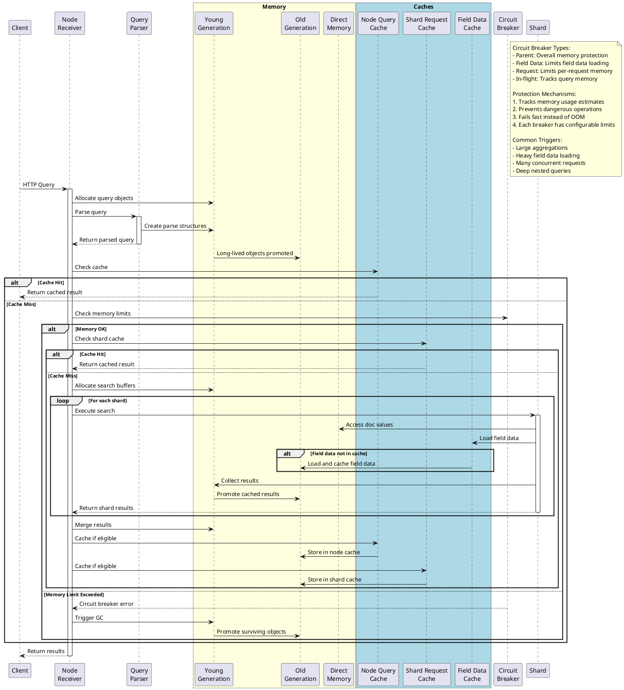

```plantuml
@startuml
participant Client
participant "Node\nReceiver" as NR
participant "Query\nParser" as QP
box "Memory" #LightYellow
    participant "Young\nGeneration" as YG
    participant "Old\nGeneration" as OG
    participant "Direct\nMemory" as DM
end box
box "Caches" #LightBlue
    participant "Node Query\nCache" as NQC
    participant "Shard Request\nCache" as SRC
    participant "Field Data\nCache" as FDC
end box
participant "Circuit\nBreaker" as CB
note right of CB
  Circuit Breaker Types:
  - Parent: Overall memory protection
  - Field Data: Limits field data loading
  - Request: Limits per-request memory
  - In-flight: Tracks query memory

  Protection Mechanisms:
  1. Tracks memory usage estimates
  2. Prevents dangerous operations
  3. Fails fast instead of OOM
  4. Each breaker has configurable limits

  Common Triggers:
  - Large aggregations
  - Heavy field data loading
  - Many concurrent requests
  - Deep nested queries
end note
participant "Shard" as S

Client -> NR: HTTP Query
activate NR

NR -> YG: Allocate query objects
NR -> QP: Parse query
activate QP
QP -> YG: Create parse structures
QP --> NR: Return parsed query
deactivate QP

YG -> OG: Long-lived objects promoted

NR -> NQC: Check cache
alt Cache Hit
    NQC --> Client: Return cached result
else Cache Miss
    NR -> CB: Check memory limits

    alt Memory OK
        NR -> SRC: Check shard cache

        alt Cache Hit
            SRC --> NR: Return cached result
        else Cache Miss
            NR -> YG: Allocate search buffers
            loop For each shard
                NR -> S: Execute search
                activate S
                S -> DM: Access doc values
                S -> FDC: Load field data
                alt Field data not in cache
                    FDC -> OG: Load and cache field data
                end
                S -> YG: Collect results
                YG -> OG: Promote cached results
                S --> NR: Return shard results
                deactivate S
            end

            NR -> YG: Merge results
            NR -> NQC: Cache if eligible
            NQC -> OG: Store in node cache
            NR -> SRC: Cache if eligible
            SRC -> OG: Store in shard cache
        end
    else Memory Limit Exceeded
        CB --> NR: Circuit breaker error
        NR -> YG: Trigger GC
        YG -> OG: Promote surviving objects
    end
end

NR --> Client: Return results
deactivate NR

@enduml
```